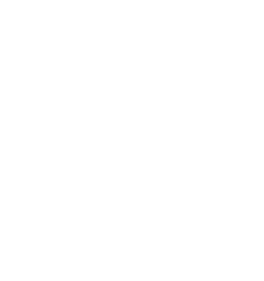
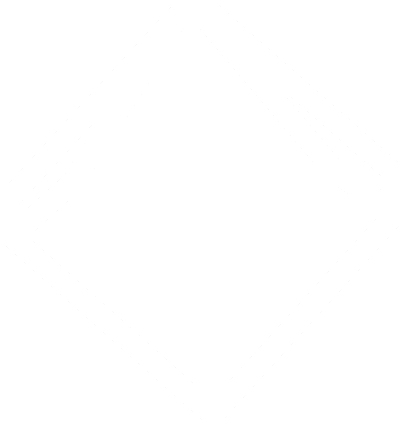
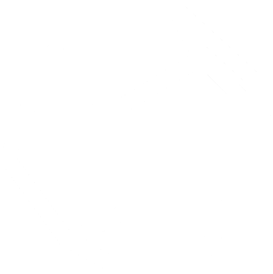
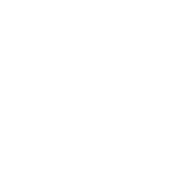

Hier eine Übersicht für die bekanntesten Würfeln in Pen and Paper.

|Name|Bild|Beschreibung|
|---|---|---|
|W4/D4|<figure markdown>{ width="70" }</figure>|Ein Tetraeder, hier ist die Ecke wichtig die nach oben zeigt, keine Fläche. Um die Ecke ist dann die jewalige Zahl dargestellt|
|W6/D6|<figure markdown>{ width="70" }</figure>|Ein klassischer Würfel mit 6 Seiten, ein Hexaeder|
|W8/D8|<figure markdown>{ width="70" }</figure>|Ein Oktaeder|
|W10/D10|<figure markdown>{ width="70" }</figure>|Ein 10-seitiger Körper (der einzige Würfel, der kein platonischer Körper ist)|
|W100/D100|<figure markdown>{ width="140" }</figure>|Für diesen wirft man 2 10-seitige Würfel, wobei einer die 1-er und einer die 10-er Stelle repräsentiert|
|W12/D12|<figure markdown>{ width="70" }</figure>|Ein Dodekaeder|
|W20/D20|<figure markdown>{ width="70" }</figure>|Ein Ikosaeder|